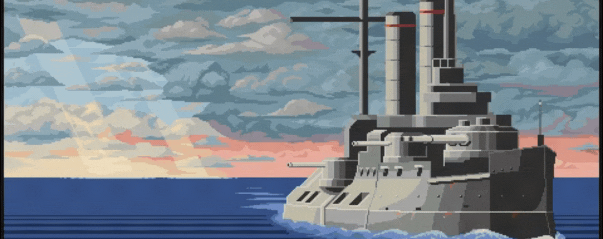
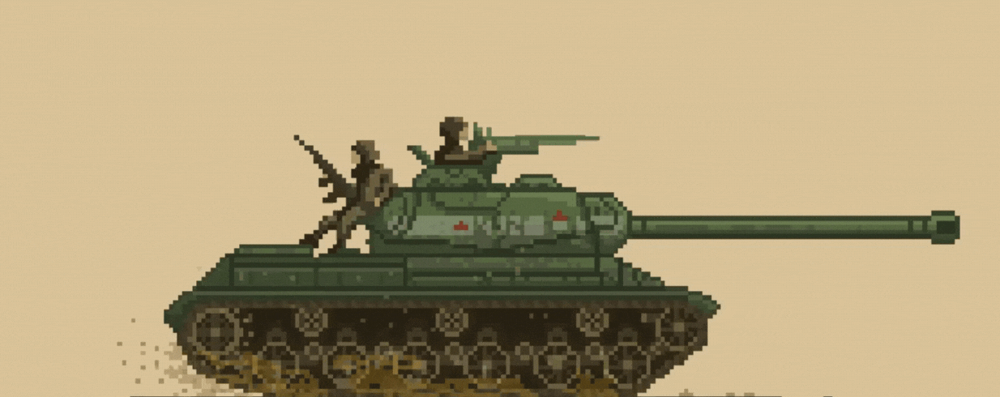
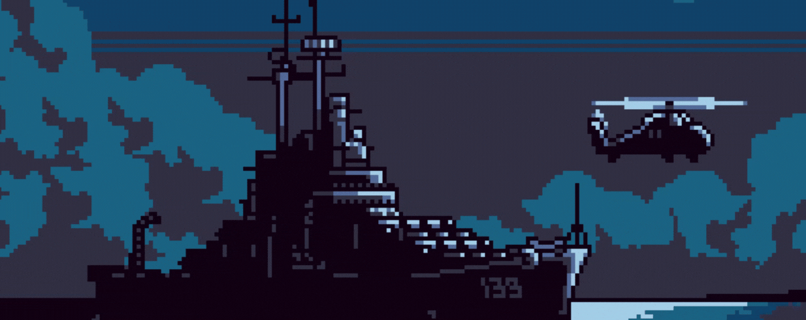

&nbsp;&nbsp;

<h1>Bem-vindo oa meu GitHub!</h1>

Sou desenvolvedor com experiência em projetos de pesquisa e ampla atuação em diversas áreas do desenvolvimento de sistemas.

<h2>Áreas de interesse e atuação</h2>

- Inteligência Artificial 
- Desenvolvimento de Software
- Microcontroladores e Sistemas Embarcados

&nbsp;

 

 

 
    
 
  

 
 &nbsp;
 &nbsp;

## Minhas Habilidades

&nbsp;

#### 👩‍💻 Languages 
&nbsp;
&nbsp;
&nbsp;

#### ⚙️ Frameworks / Libraries:
&nbsp;

&nbsp;

#### ⚙️ Tools:

&nbsp;
&nbsp;

&nbsp;
&nbsp;
&nbsp;

#### 📈 Databases:

&nbsp;
&nbsp;
&nbsp;

#### 👩‍💻 IDE:
&nbsp;

&nbsp;

&nbsp;
&nbsp;
&nbsp;

## Contacts:

 

 

&nbsp;&nbsp;

